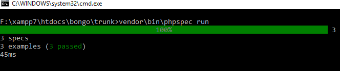
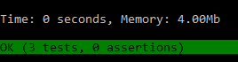

Bongo code test
================

# Solutions of tree problems are in following files:

problem1.php
problem2.php
problem3.php

These files can be run directly to view the output.

For unit testing PHPSpec library is used. In order to install the library following commands can be executed.

```
$ composer install
```

```
$ composer dump-autoload
```

```
$ vendor\bin\phpspec run
```
Use forward or backslash depending on operating system. It should display like the following screenshot:




# Runtime and memory requirement

It took around 45ms to run the problem. The time didn't change much when all three programs were run simultaneously or only problem3 was run individually. When the solution is run in PHPUnit the memory is showing 4Mb like the following screenshot.



In order to find all the ancestors of a node, at worst case it has to traverse the complete tree. So the complexity would be n. In order to find the LCA n2 would be the complexity as two nested loops are performed to find common ancestor. 

# Limitation:
In order to simultaneously run test cases for all three problems, "printDepth" function is renamed to "printDepth2" for problem2.
This limitation can easily be removed if only problem2 is used separately.

